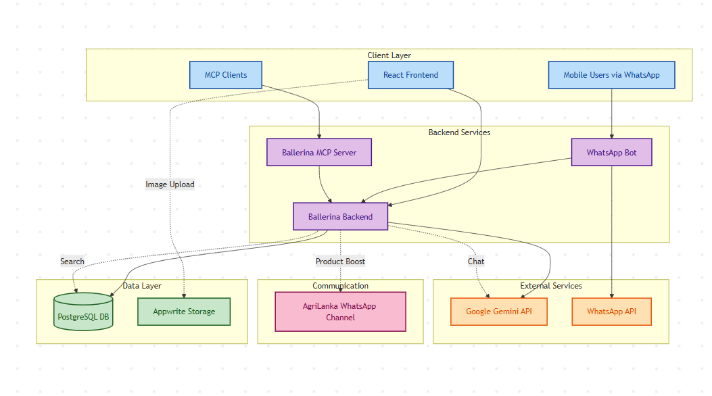

# Agriලංකා Platform Documentation

## Table of Contents

1. [Introduction](#introduction)
   - [Key Objectives](#key-objectives)
   - [Target Users](#target-users)
2. [System Architecture](#system-architecture)
   - [Architecture Principles](#architecture-principles)
3. [Core Components](#core-components)
   - [Frontend Application (React + TypeScript)](#frontend-application-react--typescript)
   - [Backend Services (Ballerina)](#backend-services-ballerina)
   - [WhatsApp Bot (Node.js)](#whatsapp-bot-nodejs)
   - [MCP Server (AI Gateway)](#mcp-server-ai-gateway)
4. [Technology Stack](#technology-stack)
   - [Frontend Technologies](#frontend-technologies)
   - [Backend Technologies](#backend-technologies)
   - [Bot and Integration Technologies](#bot-and-integration-technologies)
   - [Development and Deployment](#development-and-deployment)
5. [Marketplace API Guide](#marketplace-api-guide)
   - [Base Information](#base-information)
   - [Authentication](#authentication)
   - [Authentication Endpoints](#authentication-endpoints)
     - [Register User](#register-user)
     - [User Login](#user-login)
     - [Get User Profile](#get-user-profile)
   - [Advertisement Endpoints](#advertisement-endpoints)
     - [Create Advertisement](#create-advertisement)
     - [Get All Advertisements](#get-all-advertisements)
     - [Get Advertisement by ID](#get-advertisement-by-id)
     - [Get My Advertisements](#get-my-advertisements)
     - [Update Advertisement](#update-advertisement)
     - [Delete Advertisement](#delete-advertisement)
   - [Comment Endpoints](#comment-endpoints)
     - [Create Comment](#create-comment)
     - [Get All Comments](#get-all-comments)
     - [Get Comment by ID](#get-comment-by-id)
     - [Get Comments for Advertisement](#get-comments-for-advertisement)
     - [Delete Comment](#delete-comment)
   - [Health Check](#health-check)

---

## Introduction

Agriලංකා is a comprehensive digital marketplace platform designed specifically for the Sri Lankan agricultural sector. The platform bridges the gap between farmers and buyers by providing a modern, accessible, and feature-rich environment for agricultural commerce.

### Key Objectives
- **Reduce geographical barriers** between farmers and buyers
- **Enable price discovery** and quality comparison
- **Provide multi-channel access** (Web, WhatsApp, AI assistants)
- **Support digital transformation** for rural farmers
- **Facilitate trusted transactions** through verified listings

### Target Users
- **Farmers/Sellers**: List products, manage inventory, boost advertisements
- **Buyers**: Browse products, search by location, compare prices
- **Administrators**: Moderate content, manage users, oversee platform health

## System Architecture

The platform follows a microservices-inspired architecture with clear separation of concerns across multiple layers.



### Architecture Principles
- **Stateless Design**: Backend services are stateless, enabling horizontal scaling
- **Multi-Channel Access**: Support for web, mobile, and messaging platforms
- **AI-First**: Built-in support for AI-powered features and integrations
- **Location-Aware**: GeoHash-based proximity search and discovery

## Core Components

### Frontend Application (React + TypeScript)

The frontend is a modern single-page application built with React and TypeScript, providing a responsive and intuitive user interface.

#### Key Features
- **Role-based routing** with protected routes
- **JWT authentication** with automatic token management
- **Image upload** via Appwrite integration
- **Real-time chat** with AI assistant
- **Responsive design** with Tailwind CSS
- **Type safety** throughout the application

### Backend Services (Ballerina)

The backend is implemented using Ballerina, providing a robust and scalable API layer.

#### Core Services
- **Authentication**: JWT-based user authentication and authorization
- **Advertisement Management**: CRUD operations for product listings
- **User Management**: Profile management and role assignment
- **Comment System**: Feedback and communication between users
- **Admin Operations**: Content moderation and user management
- **AI Integration**: Gemini API for intelligent search and chat

### WhatsApp Bot (Node.js)

The WhatsApp bot provides a conversational interface for users to interact with the marketplace.

#### Bot Capabilities
- **Product Discovery**: List all products or search by keywords
- **Location-Based Search**: Find nearby products using shared location
- **Product Details**: View detailed information about specific listings
- **Automated Notifications**: Send alerts for new products
- **Ad Boosting**: Automatically promote qualifying advertisements

### MCP Server (AI Gateway)

The Model Context Protocol (MCP) server enables AI assistants to access marketplace data.

## Technology Stack

### Frontend Technologies
- **React 18**: Modern UI library with hooks and concurrent features
- **TypeScript**: Type-safe JavaScript with enhanced developer experience
- **Vite**: Fast build tool and development server
- **Tailwind CSS**: Utility-first CSS framework
- **React Router**: Client-side routing and navigation
- **Appwrite SDK**: Backend-as-a-Service for image storage

### Backend Technologies
- **Ballerina**: Cloud-native programming language for integration
- **PostgreSQL (Neon)**: Managed PostgreSQL database service
- **JWT**: JSON Web Tokens for stateless authentication
- **Google Gemini API**: AI-powered natural language processing

### Bot and Integration Technologies
- **Node.js**: JavaScript runtime for the WhatsApp bot
- **whatsapp-web.js**: WhatsApp Web API wrapper
- **Puppeteer**: Headless Chrome for WhatsApp Web automation
- **MCP Protocol**: Model Context Protocol for AI integration

### Development and Deployment
- **pnpm**: Fast, disk space efficient package manager
- **Git**: Version control system
- **Environment Configuration**: TOML and ENV files for configuration management

# Marketplace API Guide

## Base Information

- **Base URL**: `http://localhost:8080`
- **Content Type**: `application/json`
- **Server**: Ballerina

## Authentication

This API uses Bearer token authentication. Include the token in the Authorization header for protected endpoints:

```
Authorization: Bearer <your-token>
```

## Endpoints

### Health Check

#### Get API Health Status
```http
GET /health
```

**Response**: `200 OK`
- Returns API health status

---

## Authentication Endpoints

### Register User
```http
POST /auth/register
Content-Type: application/json
```

**Request Body**:
```json
{
  "username": "johndoe",
  "email": "user@example.com",
  "password": "securepassword",
  "location": {
    "name": "Colombo",
    "lat": 6.9271,
    "lng": 79.8612,
    "geohash": "tc2m4z0f0"
  },
  "phone": "+94771234567"
}
```

**Response**: `201 Created`

### User Login
```http
POST /auth/login
Content-Type: application/json
```

**Request Body**:
```json
{
  "email": "user@example.com",
  "password": "userpassword",
  "location": {
    "name": "Kandy",
    "lat": 7.2906,
    "lng": 80.6337,
    "geohash": "tc31k23wn"
  }
}
```

**Response**: Returns authentication token
- **Success**: `200 OK` with token
- **Error**: `400 Bad Request` if required fields are missing

**Note**: The password field is required for login requests.

### Get User Profile
```http
GET /auth/profile
Authorization: Bearer <token>
```

**Response**: 
- **Success**: `200 OK` with user profile
- **Unauthorized**: `401 Unauthorized` if token is invalid

---

## Advertisement Endpoints

### Create Advertisement
```http
POST /advertisements
Authorization: Bearer <token>
Content-Type: application/json
```

**Request Body**:
```json
{
  "title": "iPhone 13 Pro Max",
  "description": "Excellent condition, lightly used, box and charger included.",
  "price": "999.99",
  "location": {
    "name": "Colombo",
    "lat": 6.9271,
    "lng": 79.8612,
    "geohash": "tc2m4z0f0"
  },
  "category": "Electronics",
  "userEmail": "user@example.com",
  "photoUrls": [
    "https://example.com/photo1.jpg",
    "https://example.com/photo2.jpg"
  ]
}
```

**Response**: 
- **Success**: `201 Created`
- **Unauthorized**: `401 Unauthorized` if not authenticated

### Get All Advertisements
```http
GET /advertisements
```

**Response**: `200 OK`
- Returns list of all advertisements
- **No authentication required**

### Get Advertisement by ID
```http
GET /advertisements/{id}
```

**Response**: `200 OK`
- Returns specific advertisement details
- **No authentication required**

### Get My Advertisements
```http
GET /advertisements/my-ads
Authorization: Bearer <token>
```

**Response**: 
- **Success**: `200 OK` with user's advertisements
- **Unauthorized**: `401 Unauthorized` if not authenticated

### Update Advertisement
```http
PUT /advertisements/{id}
Authorization: Bearer <token>
Content-Type: application/json
```

**Request Body**:
```json
{
  "title": "Updated iPhone 13 Pro Max",
  "description": "Updated description with more details.",
  "price": "899.99",
  "location": {
    "name": "Galle",
    "lat": 6.0535,
    "lng": 80.2200,
    "geohash": "tc2f0m3j3"
  },
  "category": "Mobile Phones",
  "photoUrls": [
    "https://example.com/new_photo1.jpg"
  ]
}
```

**Response**: 
- **Success**: `200 OK`
- **Unauthorized**: `401 Unauthorized` if not authenticated

### Delete Advertisement
```http
DELETE /advertisements/{id}
Authorization: Bearer <token>
```

**Response**: 
- **Success**: `200 OK` or `204 No Content`
- **Unauthorized**: `401 Unauthorized` if not authenticated

---

## Comment Endpoints

### Create Comment
```http
POST /comments
Authorization: Bearer <token>
Content-Type: application/json
```

**Request Body**:
```json
{
  "ad_id": 1,
  "sentiment": "good",
  "description": "Great product! Very satisfied."
}
```

**Valid Sentiment Values**: `good`, `bad`, `neutral` (other values like `amazing` will be rejected)

**Response**: 
- **Success**: `201 Created`
- **Unauthorized**: `401 Unauthorized` if not authenticated
- **Bad Request**: `400 Bad Request` if sentiment is invalid

### Get All Comments
```http
GET /comments
```

**Response**: `200 OK`
- Returns list of all comments
- **No authentication required**

### Get Comment by ID
```http
GET /comments/{id}
```

**Response**: `200 OK`
- Returns specific comment details
- **No authentication required**

### Get Comments for Advertisement
```http
GET /comments/ad/{adId}
```

**Response**: `200 OK`
- Returns all comments for a specific advertisement
- **No authentication required**

### Delete Comment
```http
DELETE /comments/{id}
Authorization: Bearer <token>
```

**Response**: 
- **Success**: `200 OK` or `204 No Content`
- **Unauthorized**: `401 Unauthorized` if not authenticated

---