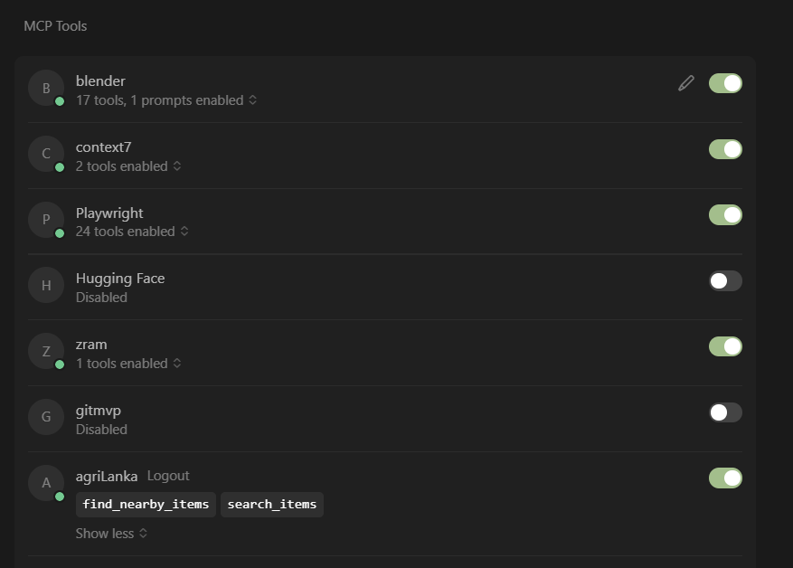

# AgriLanka MCP Server 

A tool that helps you find agricultural products and services through AI assistants.

## What it does

This server connects AI assistants (like Claude) to an agricultural marketplace, letting you:
- Find farm products near your location
- Search for specific agricultural items

## Quick Setup

### What you need
- Ballerina programming language installed
- Agricultural marketplace API running (usually on your computer)

### Installation
1. Download the project files
2. Open terminal/command prompt
3. Go to the project folder
4. Run: `bal build`

### Start the server
```bash
bal run
```

You'll see: `Server URL for MCP clients: http://localhost:8081`

## Two main features

### 1. Find nearby products
**What it does:** Shows farm products near your location

**How to use:** Provide a location code (geohash)
- Example location codes: "tc1p", "tc1q", "tc2a"

### 2. Search for products
**What it does:** Finds specific products by keywords

**How to use:** Tell it what you're looking for
- Examples: "rice seeds", "organic fertilizer", "coconut", "vegetables"

## Connect to MCP Client

> ⚠️ Note: Connecting to a remote MCP server via URL may have compatibility issues with the Claude desktop application. It works correctly with other MCP clients such as 5ire, Cursor, and VS Code.

Add the following to your MCP client configuration file:



```json
{
  "mcpServers": {
    "AgriLanka": {
      "url": "http://localhost:8081",
      "env": {}
    }
  }
}
```

## Example conversations

**Finding local products:**
- You: "Find farm products near location tc1p"
- Result: List of nearby farms and their products with prices and contact info

**Searching for items:**
- You: "I need organic fertilizer"
- Result: All available organic fertilizers with details and seller information

## What you get back

For each product, you'll see:
- Seller name and contact details
- Product description and price
- How much is available
- Delivery options
- Payment methods

Once set up, you can ask Claude to find farm products and it will use this server to get real marketplace data.