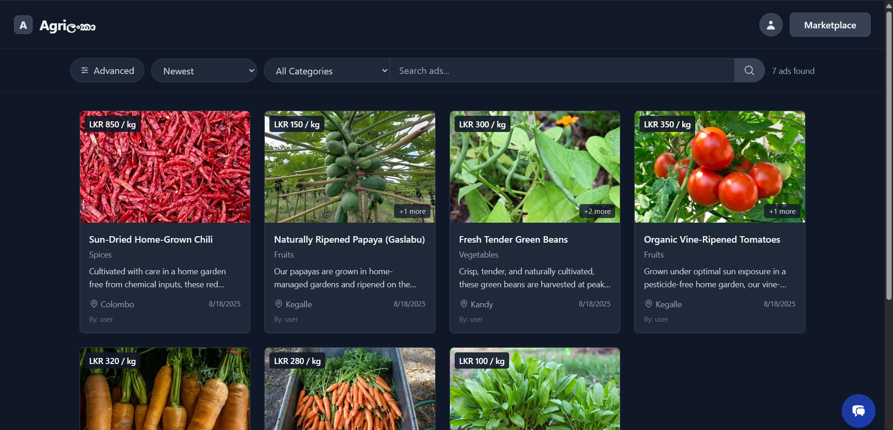
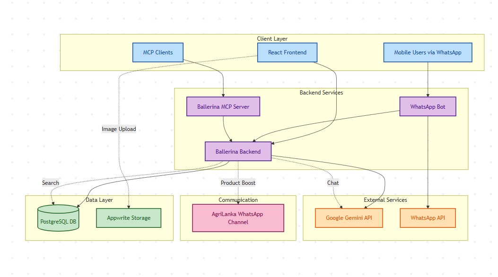

# Agriලංකා

Agriලංකා is a full-stack agriculture marketplace platform connecting farmers and buyers. It reduces distance barriers, allows price and quality comparison, and enables farmers to open a digital market with minimal effort.

The platform features a **Ballerina backend**, **React frontend**, **Appwrite for image storage**, **Neon PostgreSQL database**, **WhatsApp bot integration**, **AI-powered search via Gemini API**, and a **MCP server** for AI client access.



---

## Features

### **Core Functionalities**

* **Search & Discovery**

  * Instant search for products with live suggestions
  * Advanced search using **GeoHash** for nearby products
  * Sorting by feedback, price, and quality

* **Product Management**

  * Add, update, delete, or boost products
  * Boosted ads automatically promoted via Agriලංකා WhatsApp channel

* **User Roles**

  * Buyers, sellers, or both
  * Dashboard for sellers to manage products, view analytics, and monitor feedback
  * Admin dashboard for moderation, user/product management, and comment review

* **Communication**

  * WhatsApp bot for browsing, contacting sellers, and receiving updates
  * AI-powered chat component (Gemini API) to classify search queries and normal questions

* **AI Integration**

  * Gemini API for conversation/search-based queries
  * Chatbot supports images, product search, and real-time query handling

* **Scalability & Security**

  * JWT-based authentication
  * Stateless backend allowing horizontal scaling
  * Appwrite used for image hosting and direct frontend communication

---

## **Architecture Overview**



* **Frontend** communicates directly with Appwrite storage and the backend API.
* **Backend** manages all core logic, database queries, and external integrations.
* **WhatsApp bot** allows users to interact without installing a separate app.
* **MCP server** connects AI assistants (like Claude) to marketplace data.

---

## **Backend Configuration**

### 1. Config.toml (Required)

Create `backend/Config.toml`:

```toml
# Database Configuration
dbHost = "<your-db-host>"
dbPort = 5432
dbName = "<your-db-name>"
dbUser = "<your-db-user>"
dbPassword = "<your-db-password>"

# Server Configuration
serverHost = "localhost"
serverPort = 8080

# JWT Configuration
jwtSecret = "<your-jwt-secret>"
jwtExpiryTime = 86400.0 # 24 hours in seconds

# Gemini API Key
geminiApiKey="<your-gemini-api-key>"
```

### **Run the Backend**

```sh
cd backend
bal run
```

---

## **Frontend Configuration**

### `.env`

Create `frontend/.env`:

```env
VITE_API_URL=http://localhost:8080
VITE_APPWRITE_PROJECT_ID="<your-appwrite-project-id>"
VITE_APPWRITE_PROJECT_NAME="<your-appwrite-project-name>"
VITE_APPWRITE_ENDPOINT="<your-appwrite-endpoint>"
VITE_APPWRITE_STORAGE_BUCKET_ID="<your-appwrite-storage-bucket-id>"
```

> ⚠ Keep sensitive data out of version control.

### **Install Dependencies**

```sh
cd frontend
pnpm install
```

### **Run the Frontend**

```sh
pnpm dev
```

---

## **MCP Server (AI Client Integration)**

The **AgriLanka MCP Server** connects AI assistants to the marketplace for product search and nearby product discovery.

* [MCP Server README](MCP/README.md) - Guide for setting up and using the MCP server.

> Works with MCP-compatible clients like 5ire, Cursor, or VS Code. Claude may have compatibility issues.

---

## **WhatsApp Bot Integration**

* Users can browse ads, view product details, find nearby items, and contact sellers directly via WhatsApp.
* Boosted ads automatically appear in the Agriලංකා WhatsApp channel.

* [WhatsApp Bot README](Bots/WhatsAppBot/README.md) - Details on WhatsApp bot setup and usage.

---

## **Contributing**

Pull requests are welcome!
Please open an issue for major changes or feature requests.

---

## **License**

This project is open source under the [MIT License](LICENSE).
